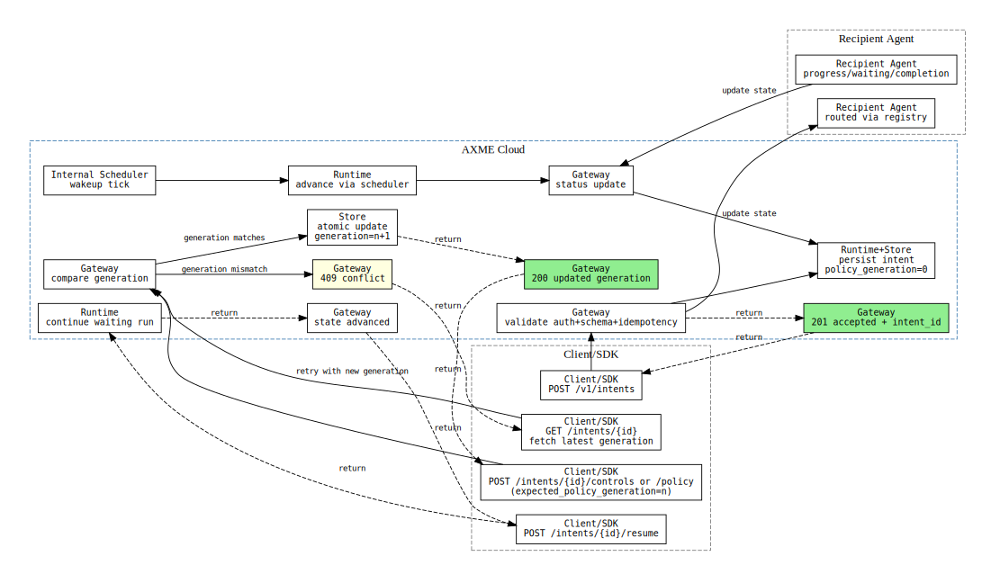
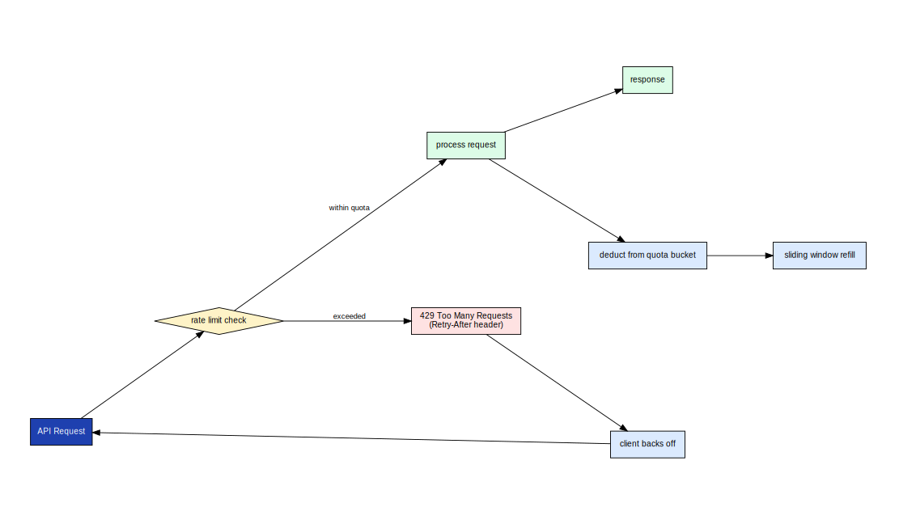
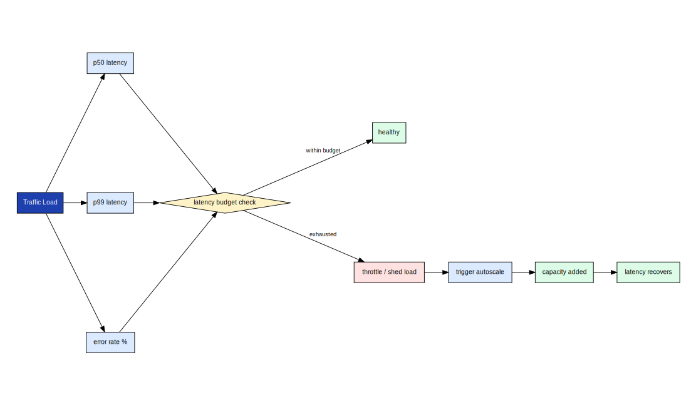

# axme-cli

**Go CLI for the AXME platform.** Manage intent lifecycle, configure runtime contexts, inspect audit logs, and operate the platform from the terminal — single binary, no runtime dependencies.

> **Alpha** · CLI surface is stabilizing. Not recommended for production scripting yet.  
> Alpha access: https://cloud.axme.ai/alpha · Contact and suggestions: [hello@axme.ai](mailto:hello@axme.ai)

---

## What Is AXME?

AXME is a coordination infrastructure for durable execution of long-running intents across distributed systems.

It provides a model for executing **intents** — requests that may take minutes, hours, or longer to complete — across services, agents, and human participants.

## AXP — the Intent Protocol

At the core of AXME is **AXP (Intent Protocol)** — an open protocol that defines contracts and lifecycle rules for intent processing.

AXP can be implemented independently.  
The open part of the platform includes:

- the protocol specification and schemas
- SDKs and CLI for integration
- conformance tests
- implementation and integration documentation

## AXME Cloud

**AXME Cloud** is the managed service that runs AXP in production together with **The Registry** (identity and routing).

It removes operational complexity by providing:

- reliable intent delivery and retries  
- lifecycle management for long-running operations  
- handling of timeouts, waits, reminders, and escalation  
- observability of intent status and execution history  

State and events can be accessed through:

- API and SDKs  
- event streams and webhooks  
- the cloud console

---

## What You Can Do With the CLI

- **Authenticate** — `axme login --web` opens the onboarding page and prompts to paste the issued API key; direct key/token input also supported
- **Manage contexts** — configure and switch between multiple gateway environments (local, staging, production)
- **Work with intents** — list, get, watch, cancel, retry, and resume intents in real time
- **Operate agents and registry** — register, list, and resolve agent identities
- **Stream logs and traces** — follow live intent event streams from the terminal
- **Diagnose** — run `doctor` to check config, connectivity, and auth health
- **Admin (platform owner)** — `axme admin` sub-commands for user management, quota overrides, scheduler health, and audit log (requires `platform_admin` JWT)

---

## Install

```bash
go install github.com/AxmeAI/axme-cli/cmd/axme@latest
```

Or build from source:

```bash
git clone https://github.com/AxmeAI/axme-cli.git
cd axme-cli
go build -o ./bin/axme ./cmd/axme
./bin/axme version
```

---

## Quick Setup

Before using the CLI, configure a context pointing to your AXME gateway:

```bash
axme context set default \
  --base-url "https://api.cloud.axme.ai" \
  --api-key "AXME_API_KEY_FROM_CLOUD_ALPHA" \
  --actor-token "OPTIONAL_USER_OR_SESSION_TOKEN" \
  --org-id "org_..." \
  --workspace-id "ws_..." \
  --owner-agent "agent://your-service" \
  --environment "production"

axme context use default
axme status        # check connectivity
axme whoami        # verify identity
```

`--api-key` maps to `x-api-key` (service-account/workspace key from `https://cloud.axme.ai/alpha`); `--actor-token` maps to `Authorization: Bearer ...` for actor-scoped routes.

---

## Create and Control Sequence

The sequence diagram below shows what happens at the network level when you run `axme run` — from CLI to gateway to scheduler:



*The CLI sets idempotency keys and correlation IDs on every request. The gateway authenticates, validates, and persists the intent. Status is polled and streamed back to the terminal.*

---

## Rate Limits and Quotas

All API calls from the CLI are subject to platform rate limits. The quota model below shows how limits are applied per org, workspace, and API key:



*When a rate limit is hit, the CLI displays a `429 Too Many Requests` error with a `Retry-After` value. Retry the command after the indicated wait window.*

---

## Command Reference

### Authentication and Login
```bash
axme login                           # interactive: prompts for API key or opens browser
axme login --api-key <key>           # non-interactive: store API key directly
axme login --web                     # open cloud.axme.ai/alpha and prompt to paste returned key
axme login --web --no-browser        # skip auto-open; print URL and prompt to paste key
axme login --actor-token <jwt>       # store an actor JWT for actor-scoped routes
axme whoami                          # show current identity, context, and active sessions
axme logout                          # clear credentials for the active context
```

### Context Management
```bash
axme context set <name> [flags]    # configure a new context
axme context use <name>            # switch active context
axme context list                  # list all configured contexts
axme context show                  # show active context
```

### Intents
```bash
axme intents list [--status <status>] [--limit <n>]
axme intents get <intent_id>
axme intents watch <intent_id>     # stream live state events
axme intents cancel <intent_id>
axme intents retry <intent_id>
axme intents resume <intent_id>
```

### Agents and Registry
```bash
axme agents list
axme agents register --name "<name>" --capability "<capability>" --endpoint-url "<url>"
axme agents resolve "@name"
```

### Operations
```bash
axme logs <intent_id>              # fetch audit log for an intent
axme trace <intent_id>             # distributed trace view
axme raw <method> <path> [body]    # raw API call (for debugging)
axme status                        # gateway and service health
axme doctor                        # config, connectivity, and auth check
axme version                       # CLI version and build info
```

Add `--json` to any command for machine-readable output.

### Service Accounts and Keys
```bash
axme service-accounts create --org-id <org_id> --workspace-id <ws_id> --name <name> --created-by-actor-id <actor_id>
axme service-accounts list --org-id <org_id> [--workspace-id <ws_id>]
axme service-accounts keys create --service-account-id <sa_id> --created-by-actor-id <actor_id>
axme service-accounts keys revoke --service-account-id <sa_id> --key-id <sak_id>
```

### Admin (Platform Owner — requires platform_admin JWT)
```bash
axme admin users list [--domain <prefix>] [--email <prefix>] [--limit <n>]
axme admin users suspend --org-id <org_id> [--reason "<text>"]
axme admin users unsuspend --org-id <org_id>

axme admin quota get --org-id <org_id> --workspace-id <ws_id>
axme admin quota set --org-id <org_id> --workspace-id <ws_id> \
  --intents-per-day <n> [--actors-total <n>] [--service-accounts <n>]
axme admin quota reset --org-id <org_id> --workspace-id <ws_id> \
  --tier <unverified|email_verified|corporate>

axme admin scheduler health          # GET /health with component table

axme admin audit [--action <prefix>] [--owner-agent <agent>] [--limit <n>]
```

---

## Capacity and Latency Budget

For teams doing performance analysis or capacity planning:



*The CLI adds negligible latency overhead. Gateway p99 is the dominant term. Use `axme raw` to send a custom request and inspect the raw response for debugging.*

---

## Repository Structure

```
axme-cli/
├── cmd/
│   └── axme/                  # main entry point and command tree
├── docs/
│   ├── diagrams/              # Diagram copies for README embedding
│   └── commands/              # Per-command reference pages
└── go.mod
```

---

## Tests

```bash
go test ./...
```

---

## Related Repositories

| Repository | Role |
|---|---|
| [axme-sdk-go](https://github.com/AxmeAI/axme-sdk-go) | Go SDK that the CLI is built on |
| [axme-docs](https://github.com/AxmeAI/axme-docs) | Full API reference and integration guides |
| Runtime operations (private) | Deployment and operational runbooks are maintained internally |

---

## Contributing & Contact

- Bug reports and feature requests: open an issue in this repository
- Alpha access: https://cloud.axme.ai/alpha · Contact and suggestions: [hello@axme.ai](mailto:hello@axme.ai)
- Security disclosures: see [SECURITY.md](SECURITY.md)
- Contribution guidelines: [CONTRIBUTING.md](CONTRIBUTING.md)
